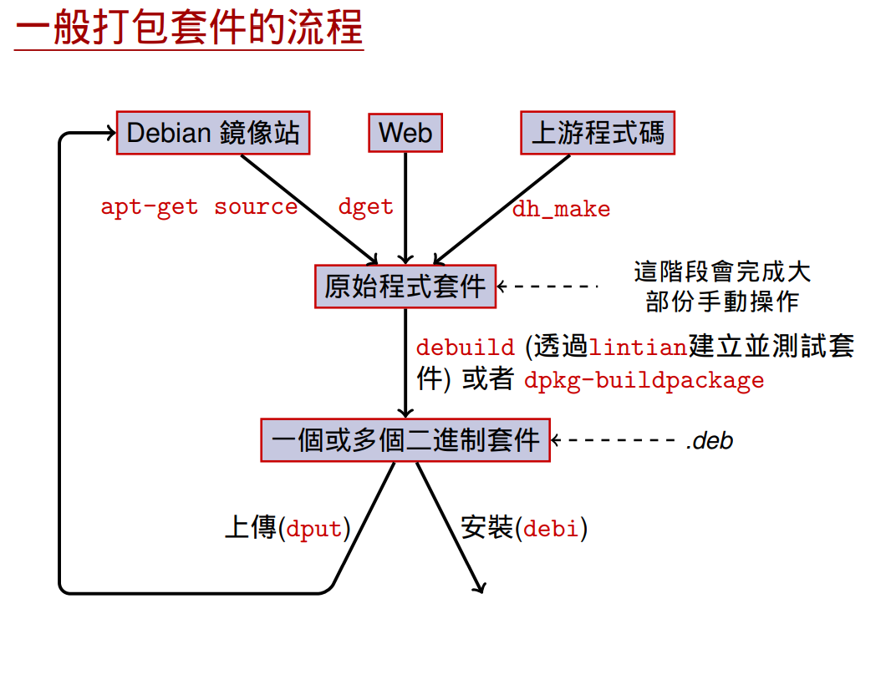

# demo_dh_make

Refer to this workflow:



1. [Use dh_make to generate debian folder](#use-dh_make-to-generate-debian-folder)
2. [Add hello world](#add-hello-world)
3. [debuild](#debuild)

## Use dh_make to generate debian folder

```bash
mkdir demo_dh_make
cd demo_dh_make
git init # this repo
dh_make -s -c gpl -n -e timchen@ingrasys.com -p helloworld_0.1
```

Tree:

```
.
├── debian
│   ├── changelog
│   ├── compat
│   ├── control
│   ├── copyright
│   ├── helloworld.cron.d.ex
│   ├── helloworld.default.ex
│   ├── helloworld.doc-base.EX
│   ├── helloworld-docs.docs
│   ├── init.d.ex
│   ├── manpage.1.ex
│   ├── manpage.sgml.ex
│   ├── manpage.xml.ex
│   ├── menu.ex
│   ├── postinst.ex
│   ├── postrm.ex
│   ├── preinst.ex
│   ├── prerm.ex
│   ├── README
│   ├── README.Debian
│   ├── README.source
│   ├── rules
│   └── source
│       └── format
└── README.md
```

=> [Result commit](https://github.com/timmy00274672/demo_dh_make/commit/58ba7f40cf1e18b48296d9701a57ec8ad9bd9faf)

## Add hello world

Tree:

```
.
├── debian
│   ├── changelog
│   ├── compat
│   ├── control
│   ├── copyright
│   ├── helloworld.cron.d.ex
│   ├── helloworld.default.ex
│   ├── helloworld.doc-base.EX
│   ├── helloworld-docs.docs
│   ├── init.d.ex
│   ├── manpage.1.ex
│   ├── manpage.sgml.ex
│   ├── manpage.xml.ex
│   ├── menu.ex
│   ├── postinst.ex
│   ├── postrm.ex
│   ├── preinst.ex
│   ├── prerm.ex
│   ├── README
│   ├── README.Debian
│   ├── README.source
│   ├── rules
│   └── source
│       └── format
├── Makefile                        <==================== new
├── README.md
└── src                             <==================== new
    └── hello.c                     <==================== new
```

=> [Result commit](https://github.com/timmy00274672/demo_dh_make/commit/61f5b7f68301a21dead552a02e0babc698ab0104)

## debuild

* run `debuild` to prepare deb files
* build log => [debuild.log](debuild.log)
* Notes:
    * deb / des / ... are placed in parent folder


Tree:

```
.
├── helloworld_0.1_amd64.build                      <==================== new
├── helloworld_0.1_amd64.changes                    <==================== new
├── helloworld_0.1_amd64.deb                        <==================== new
├── helloworld_0.1.dsc                              <==================== new
├── helloworld_0.1.tar.xz                           <==================== new
└── helloworlddeb
    ├── debian
    │   ├── changelog
    │   ├── compat
    │   ├── control
    │   ├── copyright
    │   ├── debhelper-build-stamp                   <==================== new
    │   ├── files                                   <==================== new
    │   ├── helloworld                              <==================== new
    │   │   ├── bin                                 <==================== new
    │   │   │   └── hello                           <==================== new
    │   │   ├── DEBIAN                              <==================== new
    │   │   │   ├── control                         <==================== new
    │   │   │   └── md5sums                         <==================== new
    │   │   └── usr                                 <==================== new
    │   │       └── share                           <==================== new
    │   │           └── doc                         <==================== new
    │   │               └── helloworld              <==================== new
    │   │                   ├── changelog.gz        <==================== new
    │   │                   ├── copyright           <==================== new
    │   │                   └── README.Debian       <==================== new
    │   ├── helloworld.cron.d.ex
    │   ├── helloworld.debhelper.log
    │   ├── helloworld.default.ex
    │   ├── helloworld.doc-base.EX
    │   ├── helloworld-docs.docs
    │   ├── helloworld.substvars                    <==================== new
    │   ├── init.d.ex
    │   ├── manpage.1.ex
    │   ├── manpage.sgml.ex
    │   ├── manpage.xml.ex
    │   ├── menu.ex
    │   ├── postinst.ex
    │   ├── postrm.ex
    │   ├── preinst.ex
    │   ├── prerm.ex
    │   ├── README
    │   ├── README.Debian
    │   ├── README.source
    │   ├── rules
    │   └── source
    │       └── format
    ├── debian_workflow.png
    ├── debuild.log
    ├── Makefile
    ├── README.md
    └── src
        ├── hello                                   <==================== new
        └── hello.c
```

=> [Result commit](https://github.com/timmy00274672/demo_dh_make/commit/10fb30104ff5e897e2adbaeadd56014f6a4646c5)